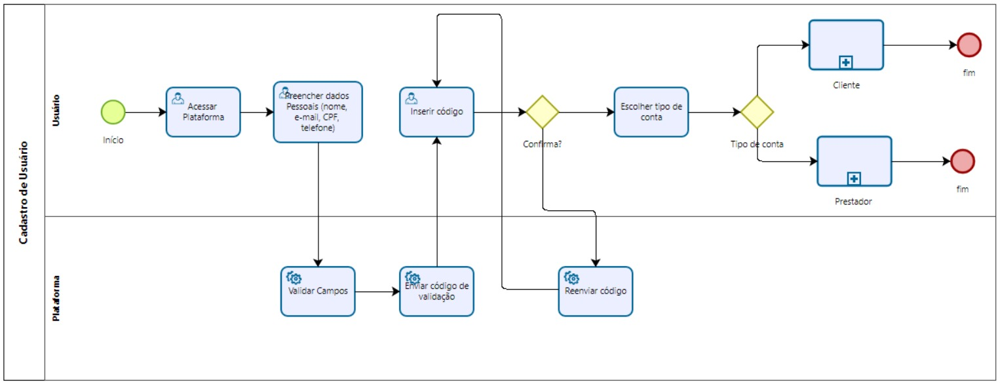
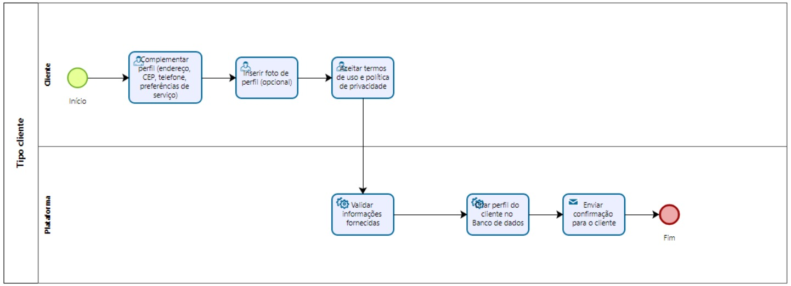
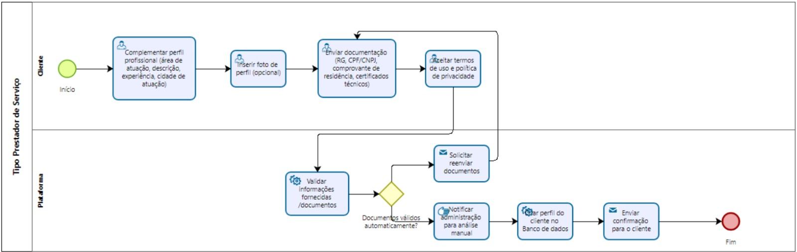
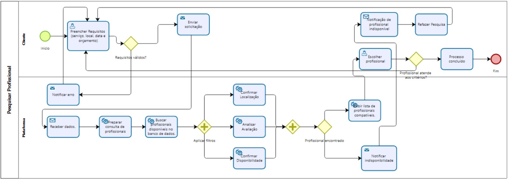
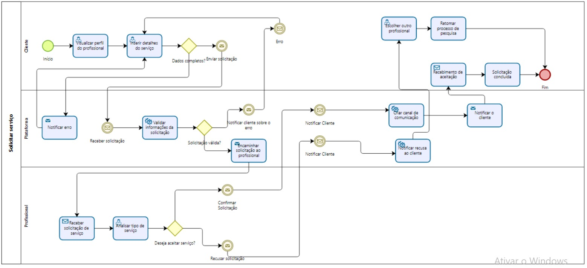

m## 3. Modelagem dos Processos de Negócio

### 3.1. Modelagem da situação atual (Modelagem AS IS)
Atualmente, a contratação de serviços manuais (como pintura, elétrica ou hidráulica) ocorre de forma informal e descentralizada. Clientes recorrem a grupos de WhatsApp, redes sociais, anúncios de internet ou indicações de conhecidos para encontrar prestadores de serviço. Esse processo traz diversos problemas: insegurança, falta de garantias e dificuldade de verificar a qualidade do profissional. 

Exemplo de como o processo acontece hoje: 

O cliente percebe a necessidade de um serviço. 

Ele procura por profissionais em grupos, redes sociais ou por indicação de conhecidos. 

A negociação acontece de maneira informal, via telefone ou mensagens. 

O pagamento é feito diretamente (dinheiro ou transferência), sem contrato. 

O serviço é executado, mas sem garantia formal ou registro de avaliação. 

Esse fluxo é manual, ineficiente e sem padrão, gerando riscos como golpes, serviços mal executados e falta de transparência. Os profissionais também sofrem, já que trabalham de forma informal e com baixa visibilidade. 

 

### 3.2. Descrição geral da proposta (Modelagem TO BE)

A proposta do projeto Mão na Massa é transformar um processo atualmente informal e descentralizado em uma experiência digital centralizada, eficiente e segura. O modelo TO-BE descreve como o fluxo de contratação de serviços será reorganizado a partir da introdução da plataforma, considerando as necessidades de Contratantes, Prestadores de Serviço e Administrador.

Principais melhorias em relação ao AS-IS:

Centralização do processo: todas as etapas (busca, contato, negociação, contratação, pagamento e avaliação) passam a ocorrer dentro da plataforma.

Comunicação integrada: chat e chamadas de vídeo permitem esclarecer dúvidas e evitar deslocamentos desnecessários.

Reputação e confiabilidade: sistema de avaliações mútuas reduz riscos de fraudes e aumenta a confiança.

Notificações e agenda: o prestador é informado em tempo real sobre novas solicitações e pode organizar sua agenda diretamente no sistema.

Gestão administrativa: o administrador terá acesso a relatórios, dados de uso da plataforma e poderá gerenciar permissões de usuários.

Limites da solução:

Requer acesso à internet e dispositivos digitais, o que pode excluir parte do público.

A qualidade final do serviço ainda depende da atuação do prestador.

É necessária moderação constante do administrador para evitar fraudes ou conflitos.

 
### 3.3. Modelagem dos processos

3.3. Modelagem dos processos
PROCESSO 1 - Cadastro de Usuários

PROCESSO 2 - Login de Usuários

PROCESSO 3 - Personalização de Perfil

PROCESSO 4 - Envio de Perguntas e Respostas