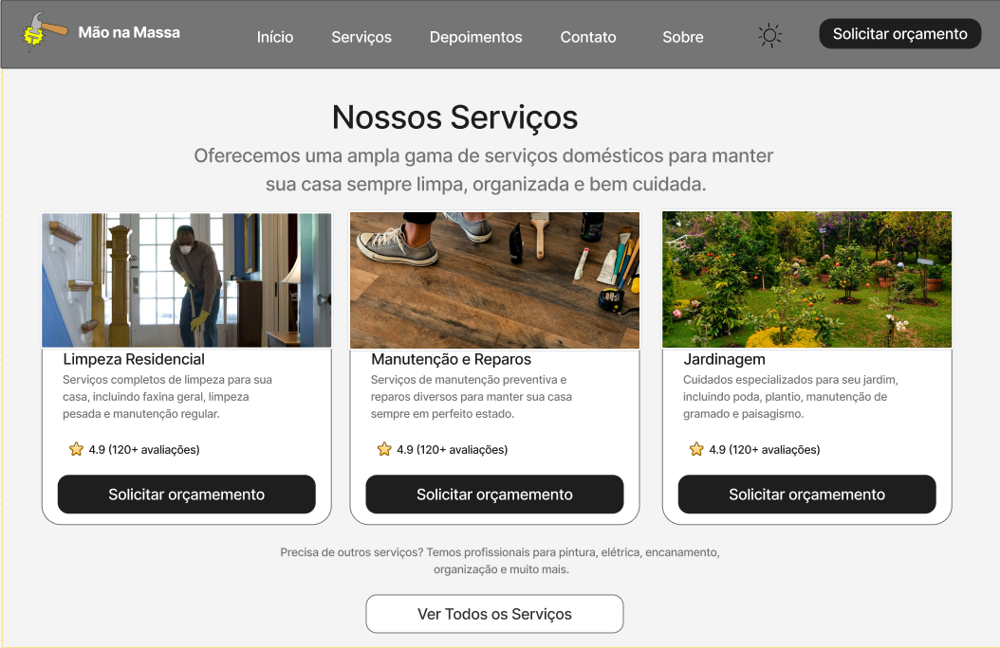
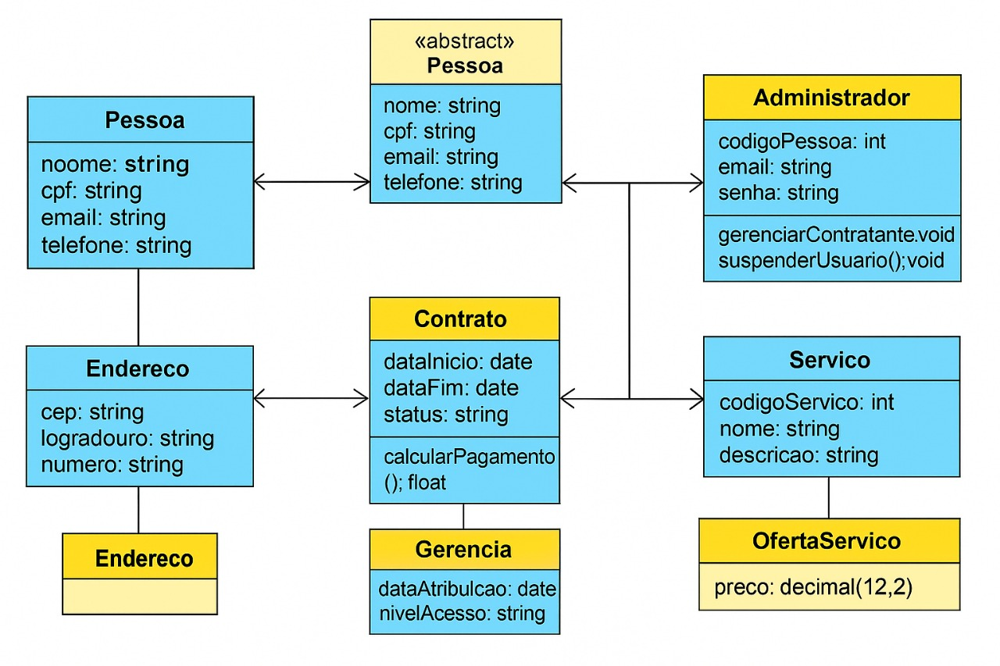
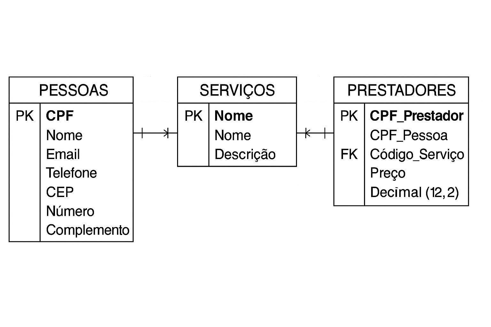

## 4. Projeto da Solução

Pré-requisitos: <a href="03-Modelagem do Processo de Negocio.md"> Modelagem do Processo de Negocio</a>

## 4.1. Arquitetura da solução

......  COLOQUE AQUI O SEU TEXTO E O DIAGRAMA DE ARQUITETURA .......

 Inclua um diagrama da solução e descreva os módulos e as tecnologias
 que fazem parte da solução. Discorra sobre o diagrama.
 
 **Exemplo do diagrama de Arquitetura**:
 
 
 

### 4.2. Protótipos de telas

O protótipo desenvolvido apresenta a visão geral da plataforma Mão na Massa, que conecta clientes a profissionais especializados em serviços domésticos. O design das telas foi elaborado para ser simples, direto e responsivo, garantindo facilidade de uso, navegabilidade intuitiva e experiência agradável ao usuário.

As telas contemplam tanto os clientes quanto os contribuidores (prestadores de serviços), atendendo às histórias de usuário levantadas na especificação do projeto. A organização segue requisitos funcionais (cadastro, login, solicitação de orçamento, exibição de serviços e avaliações) e requisitos não funcionais (usabilidade, clareza visual, acessibilidade, responsividade e segurança na autenticação).

Cada interface foi pensada para guiar o usuário em um fluxo claro: conhecer os serviços, avaliar credibilidade, solicitar orçamento ou se cadastrar, acompanhar status e feedback.

Tela Inicial

Tela de Serviços

Tela FeedBack dos Clientes 

## Diagrama de Classes

### 4.3. Modelo de dados

Entidades identificadas: Contratado (forte), Gerente (forte), Contrato (forte), Contratante (fraca)
R1: Contratado — Gerente (Tipo: Forte) : Um gerente pode ser responsável por um contratado
R2: Contratado — Contrato (Tipo: Forte) : Um contratado participa de um contrato
R3: Contrato — Contratante (Tipo: Fraco) : A existência de um contrato depende de uma contratante associada
R4: Gerencia — Contratante (Tipo: Forte) : A entidade Gerencia (forte) se relaciona com a Contratante para definir quem administra a relação contratual
Relacionamento N-ário ( relacionamento geral )

#### 4.3.1 Modelo ER

#### 4.3.2 Esquema Relacional

#### 4.3.3 Modelo Físico
Abaixo está o script SQL completo para a criação do banco de dados mão na massa, com todas as tabelas necessárias para suportar os processos de negócio definidos.

Configuração Inicial do Banco de Dados:
-- Apaga o banco de dados existente, se houver, para evitar erros e garantir a nova estrutura.
DROP DATABASE IF EXISTS mao_na_massa;

-- Cria o novo banco de dados.
CREATE DATABASE mao_na_massa;

-- Seleciona o banco de dados para os comandos seguintes.
USE mao_na_massa;

-- Tabela central para armazenar dados de TODOS os usuários.
CREATE TABLE Pessoas (
    CPF CHAR(11) PRIMARY KEY,
    Nome VARCHAR(100) NOT NULL,
    Email VARCHAR(100) NOT NULL UNIQUE,
    Senha VARCHAR(255) NOT NULL, -- Senha deve ser armazenada como hash
    Telefone VARCHAR(15) NOT NULL,
    CEP CHAR(8),
    Logradouro VARCHAR(255),
    Numero VARCHAR(20),
    URL_Foto_Perfil VARCHAR(255),
    Status_Conta ENUM('Ativo', 'Pendente', 'Bloqueado') NOT NULL DEFAULT 'Ativo',
    Data_Cadastro DATETIME DEFAULT CURRENT_TIMESTAMP
);

-- Tabela para catalogar os tipos de serviços oferecidos na plataforma.
CREATE TABLE Servicos (
    ID_Servico INT AUTO_INCREMENT PRIMARY KEY,
    Nome VARCHAR(100) NOT NULL UNIQUE,
    Descricao TEXT
);

-- Tabela que define quais PESSOAS podem atuar como PRESTADORES.
CREATE TABLE Prestadores (
    ID_Prestador INT AUTO_INCREMENT PRIMARY KEY,
    CPF_Pessoa CHAR(11) NOT NULL,
    ID_Servico INT NOT NULL,
    Descricao_Propria_Servico TEXT,
    Status_Verificacao ENUM('Pendente', 'Aprovado', 'Reprovado') NOT NULL DEFAULT 'Pendente',
    
    FOREIGN KEY (CPF_Pessoa) REFERENCES Pessoas(CPF),
    FOREIGN KEY (ID_Servico) REFERENCES Servicos(ID_Servico),
    UNIQUE(CPF_Pessoa, ID_Servico) -- Garante que um prestador não cadastre o mesmo serviço duas vezes.
);

-- Tabela principal para gerenciar cada CONTRATAÇÃO de serviço.
CREATE TABLE Solicitacoes (
    ID_Solicitacao INT AUTO_INCREMENT PRIMARY KEY,
    CPF_Contratante CHAR(11) NOT NULL,
    ID_Prestador INT NOT NULL,
    Descricao_Problema TEXT NOT NULL,
    Status_Solicitacao ENUM('Pendente', 'Aceita', 'Recusada', 'Em_Andamento', 'Concluida_Prestador', 'Finalizada', 'Cancelada') NOT NULL DEFAULT 'Pendente',
    Valor_Negociado DECIMAL(10, 2),
    Data_Criacao DATETIME DEFAULT CURRENT_TIMESTAMP,
    Data_Agendamento DATETIME,
    Data_Conclusao DATETIME,
    
    FOREIGN KEY (CPF_Contratante) REFERENCES Pessoas(CPF),
    FOREIGN KEY (ID_Prestador) REFERENCES Prestadores(ID_Prestador)
);

-- Tabela para gerenciar os pagamentos com sistema de retenção (escrow).
CREATE TABLE Pagamentos (
    ID_Pagamento INT AUTO_INCREMENT PRIMARY KEY,
    ID_Solicitacao INT NOT NULL,
    Valor DECIMAL(10, 2) NOT NULL,
    -- ATUALIZADO: O método de pagamento agora está fixado como PIX.
    Metodo_Pagamento ENUM('PIX') NOT NULL DEFAULT 'PIX',
    -- ATUALIZADO: Status 'Nao_Gerenciado' removido.
    Status_Pagamento ENUM('Pendente', 'Retido', 'Liberado', 'Reembolsado', 'Falhou') NOT NULL DEFAULT 'Pendente',
    Data_Pagamento DATETIME,
    Data_Liberacao DATETIME,
    
    FOREIGN KEY (ID_Solicitacao) REFERENCES Solicitacoes(ID_Solicitacao)
);

-- Tabela para o sistema de avaliação mútua.
CREATE TABLE Avaliacoes (
    ID_Avaliacao INT AUTO_INCREMENT PRIMARY KEY,
    ID_Solicitacao INT NOT NULL,
    CPF_Avaliador CHAR(11) NOT NULL,
    CPF_Avaliado CHAR(11) NOT NULL,
    Nota INT NOT NULL, -- Nota de 1 a 5
    Comentario TEXT,
    Data_Avaliacao DATETIME DEFAULT CURRENT_TIMESTAMP,
    
    FOREIGN KEY (ID_Solicitacao) REFERENCES Solicitacoes(ID_Solicitacao),
    FOREIGN KEY (CPF_Avaliador) REFERENCES Pessoas(CPF),
    FOREIGN KEY (CPF_Avaliado) REFERENCES Pessoas(CPF)
);

Este script deverá ser incluído em um arquivo .sql na pasta src\bd.

### 4.4. Tecnologias
Dimensão,Tecnologia,Descrição e Finalidade
SGBD,MySQL,"Sistema de Gerenciamento de Banco de Dados relacional para armazenar de forma persistente e segura todas as informações da aplicação, como dados de pessoas, serviços e prestadores."
Front-end,"HTML5, CSS3, JavaScript (ES6+)","Tecnologias padrão da web. HTML para estruturar o conteúdo das páginas, CSS para estilização e design responsivo, e JavaScript para criar a interatividade, manipular eventos e se comunicar com o back-end."
,(Biblioteca Opcional: React ou Vue.js),"Para facilitar a criação de interfaces complexas e reativas, poderíamos adotar uma biblioteca como o React. Isso simplificaria a manipulação do estado da aplicação e a atualização da interface com base nos dados recebidos do back-end."
,(Framework CSS: Bootstrap),"Utilizaremos o Bootstrap para acelerar o desenvolvimento do design, garantindo que a aplicação seja responsiva (funcione bem em desktops, tablets e celulares) e tenha um visual moderno e consistente sem a necessidade de escrever todo o CSS do zero."
Back-end,Java (versão 17 ou superior),"Linguagem de programação robusta, segura e de alta performance que servirá como base para toda a lógica de negócio da aplicação."
,Spring Boot,"Framework que acelera o desenvolvimento de aplicações Java. Ele será usado para criar uma API RESTful, que são os ""caminhos"" (endpoints) que o front-end irá chamar para buscar, salvar, atualizar ou deletar dados no banco de dados."
,Spring Data JPA & Hibernate,"Módulos do Spring que facilitam enormemente a comunicação com o banco de dados MySQL. Eles permitem mapear as tabelas do banco para objetos Java, abstraindo a maior parte do código SQL."
,Maven,"Ferramenta de automação de compilação e gerenciamento de dependências. Será usada para gerenciar todas as bibliotecas do projeto Java (Spring, Hibernate, etc.)."
Ferramentas de Desenvolvimento,Visual Studio Code (VS Code),"IDE (Ambiente de Desenvolvimento Integrado) leve e versátil. Será usado para o desenvolvimento do front-end (HTML, CSS, JS)."
,IntelliJ IDEA Community/Ultimate,"IDE poderosa e especializada para o desenvolvimento back-end com Java e Spring Boot, oferecendo recursos avançados de depuração e produtividade."
,Git & GitHub,Sistema de controle de versão para gerenciar o histórico do código-fonte e plataforma de hospedagem de repositórios para colaboração e backup do projeto.
,Postman / Insomnia,"Ferramentas para testar a API RESTful do back-end de forma isolada, garantindo que ela funcione corretamente antes de integrá-la com o front-end."
,MySQL Workbench,"Ferramenta visual para modelar, administrar e interagir com o banco de dados MySQL."
Apresente também uma figura explicando como as tecnologias estão relacionadas ou como uma interação do usuário com o sistema vai ser conduzida, por onde ela passa até retornar uma resposta ao usuário.

+----------------+      1. Requisição HTTP      +----------------------+      4. Chamada da API      +-----------------------------+      5. Consulta SQL      +-----------------+
|                | ---------------------------> |                      | -------------------------> |                             | -------------------------> |                 |
|     Usuário    |                              |  Front-end (Navegador)|                            | Back-end API (Servidor Java)|                            | Banco de Dados  |
|   (Navegador)  |      (Renderiza HTML/CSS)    | (Hospedado no GitHub Pages) |     (Hospedado no Heroku)    |    (Hospedado no Heroku/AWS)|      (MySQL)      |
|                |                              |                      |                            |                             |                            |                 |
|                | <--------------------------- |                      | <------------------------- |                             | <------------------------- |                 |
+----------------+     12. Resposta Visual     +----------------------+     10. Resposta JSON      +-----------------------------+     8. Retorno dos Dados    +-----------------+
                         (DOM é atualizado)                                   (Dados)

