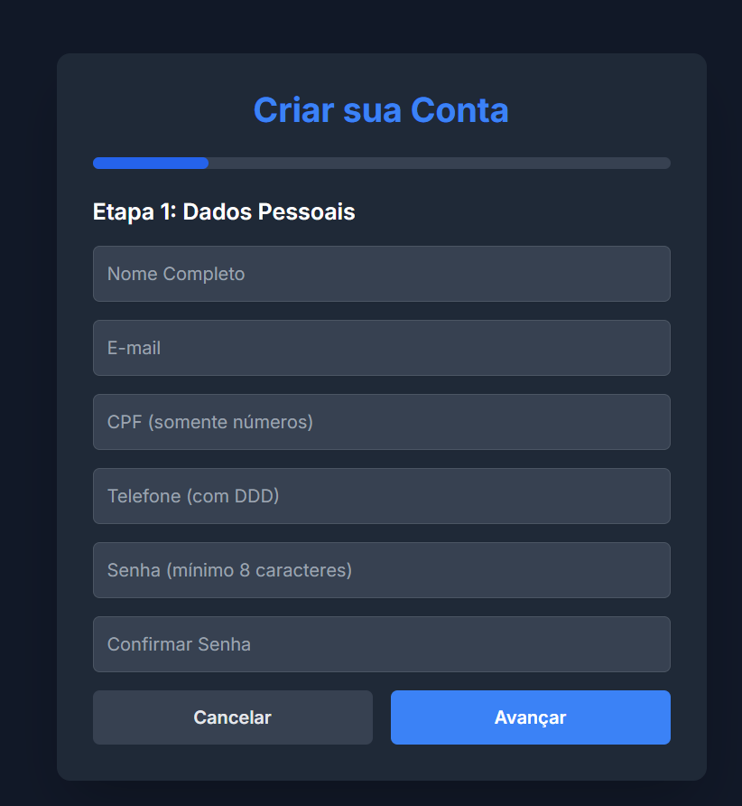
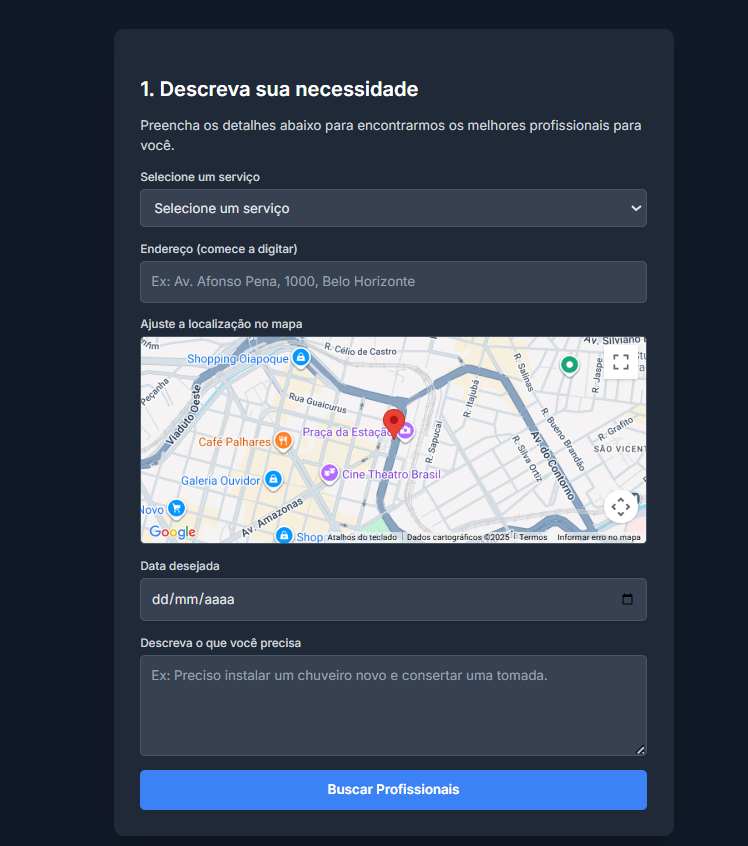

6. Interface do Sistema

Pré-requisitos: <a href="4-Projeto-Solucao.md"> Projeto da Solução</a>

A interface do sistema "Mão na Massa" foi projetada com foco na simplicidade e usabilidade, conforme definido nos protótipos de tela (Seção 4.2). O objetivo é guiar o usuário de forma intuitiva através do fluxo de contratação, desde a busca até a avaliação, garantindo uma experiência clara tanto para o Contratante quanto para o Prestador.

6.1. Tela Principal (Tela Inicial)

A Tela Inicial é o primeiro ponto de contato do usuário com a plataforma. Ela serve como portal de entrada, destacando a proposta de valor do serviço (conectar clientes a profissionais qualificados) e direcionando o usuário para as ações principais: buscar um serviço ou cadastrar-se como profissional. O design é limpo para evitar distrações e focar na conversão.

Tela principal do sistema FOTO

6.2. Telas do Processo 1 (Cadastro e Login)

O Processo 1, "Cadastro de Usuários", é dividido em telas claras de autenticação e registro.

Tela de Cadastro: O usuário seleciona seu perfil (Contratante ou Prestador). O formulário de Contratante solicita dados básicos (Nome, Email, Senha, Telefone, CEP). O formulário de Prestador, além dos dados básicos, solicita informações profissionais (Serviços prestados, descrição, documentos), conforme o RF-010 e RF-013.

Tela de Login: Uma tela simples onde o usuário insere seu Email e Senha para acessar a plataforma.

Tela de Cadastro/Login FOTO

6.3. Telas do Processo 2 (Pesquisa e Solicitação)

O Processo 2, "Pesquisar Profissional", é o coração da experiência do Contratante.

Tela de Serviços (Busca): O Contratante utiliza filtros (tipo de serviço, localização) para encontrar profissionais (RF-012, RF-014). Os resultados são exibidos em listas ou cartões, mostrando o perfil do prestador.

Tela de FeedBack (Perfil do Prestador): Ao selecionar um profissional, o Contratante acessa seu perfil detalhado. Esta tela é crucial, pois contém as avaliações de clientes anteriores (RF-005), o que ajuda a construir a confiança e a tomar a decisão de contratação. A partir daqui, o Contratante pode iniciar o Processo 3 (Solicitar Serviço).

6.3. Tela de Serviços (Busca e Listagem)
A Tela de Serviços é projetada para facilitar a conexão entre a necessidade do cliente e a oferta do profissional. Nela, o Contratante visualiza os resultados baseados nos filtros de localização (Cidade) e categoria (Checklist de serviços). A interface exibe os profissionais em formato de lista ou cartões (cards), apresentando informações essenciais de forma resumida (Nome, Especialidade e Nota Média), permitindo uma comparação rápida antes de acessar o perfil completo.

6.4. Tela de Feedback dos Clientes
A Tela de Feedback é fundamental para a credibilidade da plataforma "Mão na Massa". Esta interface exibe as avaliações e comentários deixados por clientes anteriores após a conclusão dos serviços. O sistema utiliza elementos visuais claros, como classificação por estrelas e campo de texto para depoimentos, permitindo que novos contratantes avaliem a reputação do prestador. Isso promove a segurança e incentiva a qualidade na prestação dos serviços (mitigando a informalidade sem referências).

