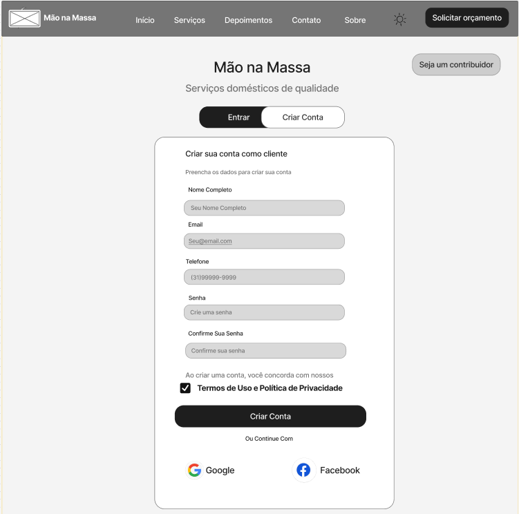
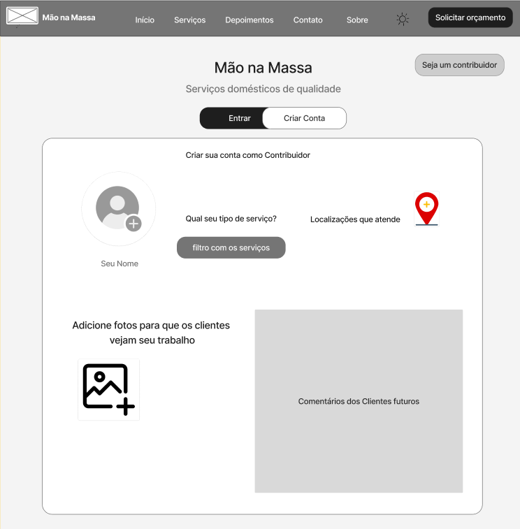

### 3.3.1 Processo 1 – CADASTRO DE USUÁRIO

O processo de "Cadastro de Usuário" tem como objetivo registrar novos usuários na plataforma, validando sua identidade inicial e, em seguida, segmentando-os em dois perfis distintos: Cliente ou Prestador. Durante o cadastro, o usuário acessa a plataforma e fornece seus dados pessoais (Nome, CPF, e-mail, telefone). A plataforma realiza uma validação inicial desses campos. Se os dados forem válidos, um código de verificação é enviado ao usuário (via e-mail ou SMS) para confirmar o canal de contato. O usuário deve inserir o código recebido. Caso o código esteja incorreto ou não seja recebido, o usuário pode solicitar o reenvio. Após a validação do código, o sistema direciona o usuário para a escolha do tipo de conta.
Se a conta for "Cliente": O usuário preenche informações adicionais (endereço, preferências), aceita os termos e, após validação da plataforma, seu perfil é criado.
Se a conta for "Prestador": O usuário preenche dados profissionais (área de atuação, experiência), envia documentação (RG, CPF/CNPJ, certificados) e aceita os termos. A plataforma realiza a validação dos dados e documentos (que pode incluir análise manual). Se aprovado, o perfil é criado.
O processo se encerra com a criação do perfil correspondente no banco de dados e o envio de uma confirmação ao usuário.
Oportunidades de melhoria: Fluxo de Reenvio de Código: O diagrama BPMN e o texto divergem ligeiramente. O diagrama sugere um loop de falha ("Confirma? -> Não"), enquanto o texto sugere uma ação iniciada pelo usuário ("pode solicitar o reenvio"). Recomenda-se implementar o reenvio como uma ação explícita (ex: um botão "Não recebi o código") para evitar confusão.
Validação de Prestador: A validação de documentos do prestador pode ser demorada, especialmente se exigir análise manual. Seria ideal implementar um "status de conta" (ex: "Pendente de Aprovação"), permitindo que o prestador acesse a plataforma com limitações enquanto aguarda a aprovação, em vez de bloquear a conclusão do cadastro.
Experiência em Erros: Implementar mensagens de validação claras e imediatas para o usuário, tanto na etapa de "Validar Campos" (ex: "CPF já cadastrado", "E-mail inválido") quanto na etapa de upload de documentos do prestador (ex: "Formato de arquivo não suportado").
Segurança de Dados: Dado que o processo coleta dados sensíveis (CPF, RG, Comprovante de Residência), é crucial garantir o armazenamento seguro (criptografia) e o tratamento desses dados em conformidade com a LGPD.

Imagem - CADASTRO DE USUÁRIO: DAVI

#### Detalhamento das atividades

Imagem - TELA: CAMILLA

### Atividade 1: Criar Conta
* **Caixa de texto** - Nome
* **Caixa de texto** - E-mail
* **Caixa de texto** - Senha
* **Caixa de texto** - Confirmação de senha
* **Link** - Login Google
* **Link** - Login Facebook

### Atividade 2: Cadastro de Colaborador
* **Caixa de texto** - Nome
* **Caixa de texto** - E-mail
* **Caixa de texto** - Telefone
* **Caixa de texto** - Senha
* **Link** - Login Google
* **Link** - Login Facebook

### Atividade 3: Localização
* **Caixa de texto** - Onde você vai?
* **Área de texto** - (Campo para detalhes/mapa da localização)

### Atividade 4: Cadastro Finalizado
* **Imagem** - (Ícone de Perfil)

**1- Preencher dados Pessoais (Usuário)**

| **Campo**       | **Tipo**         | **Restrições** | **Valor** |
| ---             | ---              | ---            | ---               |
| Nome | [Caixa de Texto]  |   Obrigatório        |     Valor default       |
| E-mail | [Caixa de Texto]  |   Obrigatório, formato de e-mail        |     Valor default       |
| CPF | [Caixa de Texto]  |   Obrigatório, 11 dígitos, formato de CPF        |     Valor default       |
| Telefone | [Caixa de Texto]  |  Obrigatório, formato de telefone (com DDD)        |     Valor default       |

| **Comandos**         |  **Destino**                   | **Tipo** |
| ---                  | ---                            | ---               |
| Avançar | Atividade "Validar Campos" (Plataforma)  | default |
| Cancelar | Evento de Início (ou tela de Login)  | cancel |

**2- Inserir código de validação**

| **Campo**       | **Tipo**         | **Restrições** | **Valor** |
| ---             | ---              | ---            | ---               |
| Confirmar | Gateway "Confirma?"  | default |
| Reenviar código | Atividade "Reenviar código" (Plataforma)  | default |

**3- Escolher tipo de conta**

| **Campo**       | **Tipo**         | **Restrições** | **Valor** |
| ---             | ---              | ---            | ---               |
| Tipo de Conta | Seleção (Radio Button)  |   Obrigatório, Opções: "Cliente" ou "Prestador"        |     Valor default       |

| **Comandos**         |  **Destino**                   | **Tipo** |
| ---                  | ---                            | ---               |
| Concluir | Gateway "Tipo de conta"  | default |
| Voltar | Tela "Inserir código de validação"  | cancel |

**4- Complementar Perfil Cliente**

| **Campo**       | **Tipo**         | **Restrições** | **Valor** |
| ---             | ---              | ---            | ---               |
| Endereço | Caixa de Texto  |   Obrigatório     |     Valor default       |
| CEP | Caixa de Texto  |  Obrigatório, formato CEP    |     Valor default       |
| Telefone | Caixa de Texto  |   Obrigatório (o texto menciona "telefone")    |     Valor default       |
| Preferências de Serviço | Área de Texto / Tags  |   Opcional     |     Valor default       |
| Foto de Perfil | Upload de Imagem  |   Opcional (ex: .jpg, .png)     |     Valor default       |
| Aceitar Termos de Uso | Caixa de Seleção  |   Obrigatório (deve ser True)     |    False      |
| Aceitar Política de Privacidade | Caixa de Seleção  |   Obrigatório (deve ser True)     |    False      |

| **Comandos**         |  **Destino**                   | **Tipo** |
| ---                  | ---                            | ---               |
| Criar Conta | Atividade "Validar Informações Cliente" (Plataforma)  | default |
| Voltar | Tela "Escolher tipo de conta"  | cancel |

**5-Complementar Perfil Prestador (Parte 1: Perfil)**

| **Campo**       | **Tipo**         | **Restrições** | **Valor** |
| ---             | ---              | ---            | ---               |
| Área de Atuação | Caixa de Seleção  |   Obrigatório     |     Valor default       |
| Descrição (Profissional) | Área de Texto  |  Obrigatório    |     Valor default       |
| Experiência | Caixa de Texto  |   Caixa de Texto / Seleção    |     Valor default       |
| Cidade de Atuação | Caixa de Texto / Seleção / Tags  |   Caixa de Texto / Seleção     |     Valor default       |
| Foto de Perfil | Upload de Imagem  |   Opcional (ex: .jpg, .png)     |     Valor default       |

| **Comandos**         |  **Destino**                   | **Tipo** |
| ---                  | ---                            | ---               |
| Próximo | Tela "Complementar Perfil Prestador (Parte 2)"  | default |
| Voltar | Tela "Escolher tipo de conta"  | cancel |

**6-Complementar Perfil Prestador (Parte 2: Documentos)**

| **Campo**       | **Tipo**         | **Restrições** | **Valor** |
| ---             | ---              | ---            | ---               |
| RG | Upload de Arquivo  |   Obrigatório (ex: .pdf, .jpg)     |     Valor default       |
| CPF / CNPJ (Profissional) | Upload de Arquivo  |  Obrigatório (ex: .pdf, .jpg)    |     Valor default       |
| Comprovante de Residência |  | Upload de Arquivo  | Obrigatório (ex: .pdf, .jpg)    |     Valor default       |
| Certificados Técnicos | Upload de Arquivo (múltiplo)   |   Opcional     |     Valor default       |
| Aceitar Termos de Uso | Caixa de Seleção  |   Obrigatório (deve ser True)     |    False       |
| Aceitar Política de Privacidade | Caixa de Seleção  |   Obrigatório (deve ser True)     |    False       |

| **Comandos**         |  **Destino**                   | **Tipo** |
| ---                  | ---                            | ---               |
| Enviar para Análise | Atividade "Validar Informações Prestador" (Plataforma)  | default |
| Voltar | Tela "Complementar Perfil Prestador (Parte 1)"  | cancel |

###  CADASTRO DE CONTRIBUIDOR 

O processo de criação de conta de contribuidor se inicia quando o novo usuário seleciona a opção "Criar Conta" e acessa a tela "Criar sua conta como Contribuidor". Em seguida, o usuário preenche suas informações de perfil, adicionando sua foto e informando seu nome.

Após essa etapa inicial, o contribuidor deve especificar os detalhes de seu serviço. Primeiramente, ele seleciona o "tipo de serviço" que oferece, utilizando o botão de filtro. Na sequência, o contribuidor indica as "Localizações que atende", definindo assim sua área de atuação geográfica.

Para completar o cadastro do perfil, o usuário deve adicionar fotos que comprovem seu trabalho, permitindo que futuros clientes possam avaliar seus serviços.

Uma vez que todas as informações são fornecidas, o contribuidor envia seu cadastro para a plataforma. A plataforma, então, recebe a solicitação e realiza a validação dos dados preenchidos. Se for identificado algum erro ou informação faltante, a plataforma notifica o usuário para que ele corrija os dados e envie novamente.

Se a validação for bem-sucedida, a plataforma processa o cadastro e cria o novo perfil de contribuidor. Uma confirmação de conta criada é enviada ao usuário, e seu perfil é ativado na plataforma, ficando visível para clientes e pronto para, futuramente, receber "Comentários dos Clientes".

Imagem - CADASTRO DE CONTRIBUIDOR: DAVI

#### Detalhamento das atividades

_Descreva aqui cada uma das propriedades das atividades do processo 2. 
Devem estar relacionadas com o modelo de processo apresentado anteriormente.

Imagem - TELA: CAMILLA

_Os tipos de dados a serem utilizados são:_

### Tela Principal - Mão na Massa
* **Imagem** - Logo "Mão na Massa"
* **Link** - Menu "Início"
* **Link** - Menu "Serviços"
* **Link** - Menu "Depoimentos"
* **Link** - Menu "Contato"
* **Link** - Menu "Sobre"
* **Seleção única** - Botão de tema (ícone sol/lua)
* **Link** - Botão "Solicitar orçamento"
* **Área de texto** - Título "Mão na Massa"
* **Área de texto** - Subtítulo "Serviços domésticos de qualidade"
* **Link** - Botão "Seja um contribuidor"
* **Link** - Botão/Aba "Entrar"
* **Link** - Botão/Aba "Criar Conta"
* **Área de texto** - Título do formulário "Criar sua conta como Contribuidor"
* **Arquivo** - Upload de foto de perfil (ícone de usuário)
* **Caixa de texto** - "Seu Nome"
* **Área de texto** - Label "Qual seu tipo de serviço?"
* **Seleção múltipla** - Botão "filtro com os serviços"
* **Área de texto** - Label "Localizações que atende"
* **Imagem** - Ícone de localização
* **Área de texto** - Label "Adicione fotos para que os clientes vejam seu trabalho"
* **Arquivo** - Botão "Adicione fotos" (ícone de imagem com "+")
* **Área de texto** - Área "Comentários dos Clientes futuros"

**1-Inserir Detalhes do Serviço**

| **Campo**       | **Tipo**         | **Restrições** | **Valor** |
| ---             | ---              | ---            | ---               |
| Menu "Início" | Link  |  N/A  |   N/A       |
| Menu "Serviços" | Link  |  N/A  |   N/A       |
| Menu "Depoimentos | Link  |  N/A  |   N/A       |
| Menu "Contato" | Link  |  N/A  |   N/A       |
| Menu "Sobre" | Link  |  N/A  |   N/A       |
| Botão Tema (Sol/Lua) | Link  |  N/A  |   Valor default      |
| Botão "Seja um contribuidor" | Link  |  N/A  |   N/A       |

| **Comandos**         |  **Destino**                   | **Tipo** |
| ---                  | ---                            | ---               |
| Clicar em Link do Menu | Tela Correspondente (Início, Serviços, etc.)  | navigation  |     
| Clicar "Solicitar orçamento" | Tela "Orçamento" | default |                |
| Clicar "Seja um contribuidor" | TAtividade "Criar Conta de Contribuidor" | default | 

**2-Controle de Acesso (Entrar / Criar Conta)**
| **Campo**       | **Tipo**         | **Restrições** | **Valor** |
| ---             | ---              | ---            | ---               |
| Título "Mão na Massa" | Área de texto  |  N/A   |   Valor default       |
| Subtítulo "Serviços..." | Área de texto  |  N/A   |   Valor default       |
| Aba/Botão "Entrar" | Link |  N/A   |   N/A        |
| Aba/Botão "Criar Conta" | Link  |  N/A   |  N/A       |

| **Comandos**         |  **Destino**                   | **Tipo** |
| ---                  | ---                            | ---               |
| Clicar em "Entrar" | Clicar em "Entrar"  | default  |     
| Clicar em "Criar Conta" | Evento "Recusar solicitação" | cancel |                |

**3-Formulário "Criar sua conta como Contribuidor**

| **Campo**       | **Tipo**         | **Restrições** | **Valor** |
| ---             | ---              | ---            | ---               |
| Título do formulário | Área de texto  |  N/A   |  "Criar sua conta como Contribuidor"     |
| Foto de Perfil | Arquivo  | Obrigatório   |   Valor default (label)       |
| Seu Nome | Caixa de texto  | Obrigatório   |  Valor default (vazio)       |
| "Qual seu tipo de serviço?" | Seleção múltipla  | N/A   |  Valor default (label)   |
| "Localizações que atende | Área de texto  | N/A   |  Valor default (label)   |
| Ícone de Localização | Imagem  | N/A   |  Valor default  |
| "Adicione fotos..." | Área de texto  | N/A   |  Valor default (label)  |
| Botão "Adicione fotos" | Arquivo | Opcional (recomendado)   | Valor default (ícone)  |
| "Comentários dos Clientes..." | Área de texto  | N/A   |  Valor default (informativo)  |

| **Comandos**         |  **Destino**                   | **Tipo** |
| ---                  | ---                            | ---               |
| Clicar em "Entrar" | Clicar em "Entrar"  | default  |     
| Clicar em "Criar Conta" | Evento "Recusar solicitação" | cancel |                |