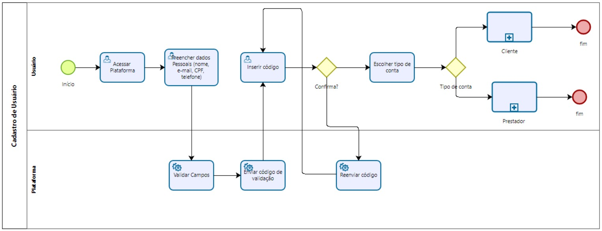

### 3.3.1 Processo 1 – CADASTRO DE USUÁRIO

O processo de "Cadastro de Usuário" tem como objetivo registrar novos usuários na plataforma, validando sua identidade inicial e, em seguida, segmentando-os em dois perfis distintos: Cliente ou Prestador. Durante o cadastro, o usuário acessa a plataforma e fornece seus dados pessoais (Nome, CPF, e-mail, telefone). A plataforma realiza uma validação inicial desses campos. Se os dados forem válidos, um código de verificação é enviado ao usuário (via e-mail ou SMS) para confirmar o canal de contato. O usuário deve inserir o código recebido. Caso o código esteja incorreto ou não seja recebido, o usuário pode solicitar o reenvio. Após a validação do código, o sistema direciona o usuário para a escolha do tipo de conta.
Se a conta for "Cliente": O usuário preenche informações adicionais (endereço, preferências), aceita os termos e, após validação da plataforma, seu perfil é criado.
Se a conta for "Prestador": O usuário preenche dados profissionais (área de atuação, experiência), envia documentação (RG, CPF/CNPJ, certificados) e aceita os termos. A plataforma realiza a validação dos dados e documentos (que pode incluir análise manual). Se aprovado, o perfil é criado.
O processo se encerra com a criação do perfil correspondente no banco de dados e o envio de uma confirmação ao usuário.
Oportunidades de melhoria: Fluxo de Reenvio de Código: O diagrama BPMN e o texto divergem ligeiramente. O diagrama sugere um loop de falha ("Confirma? -> Não"), enquanto o texto sugere uma ação iniciada pelo usuário ("pode solicitar o reenvio"). Recomenda-se implementar o reenvio como uma ação explícita (ex: um botão "Não recebi o código") para evitar confusão.
Validação de Prestador: A validação de documentos do prestador pode ser demorada, especialmente se exigir análise manual. Seria ideal implementar um "status de conta" (ex: "Pendente de Aprovação"), permitindo que o prestador acesse a plataforma com limitações enquanto aguarda a aprovação, em vez de bloquear a conclusão do cadastro.
Experiência em Erros: Implementar mensagens de validação claras e imediatas para o usuário, tanto na etapa de "Validar Campos" (ex: "CPF já cadastrado", "E-mail inválido") quanto na etapa de upload de documentos do prestador (ex: "Formato de arquivo não suportado").
Segurança de Dados: Dado que o processo coleta dados sensíveis (CPF, RG, Comprovante de Residência), é crucial garantir o armazenamento seguro (criptografia) e o tratamento desses dados em conformidade com a LGPD.

#### Detalhamento das atividades

### Atividade 1: Criar Conta
* **Caixa de texto** - Nome
* **Caixa de texto** - E-mail
* **Caixa de texto** - CPF
* **Caixa de texto** - Telefone
* **Caixa de texto** - Senha
* **Caixa de texto** - Confirmação de senha

### Atividade 2: Cadastro de Colaborador
* **Caixa de texto** - Nome
* **Caixa de texto** - E-mail
* **Caixa de texto** - CPF
* **Caixa de texto** - Telefone
* **Caixa de texto** - Senha
* **Caixa de texto** - Confirmação de senha

### Atividade 3: Verificação
* **Caixa de texto** - Um código de 6 dígitos foi enviado 

### Atividade 4: Tipo de Conta
* **Caixa de texto** - sou cliente( quero contratar serviço) 
* **Caixa de texto** - sou prestador ( quero oferecer serviço) 

**1- Preencher dados Pessoais (Usuário)**

| **Campo**       | **Tipo**         | **Restrições** | **Valor** |
| ---             | ---              | ---            | ---               |
| Nome | [Caixa de Texto]  |   Obrigatório        |     Valor default       |
| E-mail | [Caixa de Texto]  |   Obrigatório, formato de e-mail        |     Valor default       |
| CPF | [Caixa de Texto]  |   Obrigatório, 11 dígitos, formato de CPF        |     Valor default       |
| Telefone | [Caixa de Texto]  |  Obrigatório, formato de telefone (com DDD)        |     Valor default       |
| Senha | [Caixa de Texto]  |  Obrigatório, 8 dígitos minimo         |     Valor default       |
| Confirmar Senha | [Caixa de Texto]  |  Obrigatório, 8 dígitos minimo         |     Valor default       |

| **Comandos**         |  **Destino**                   | **Tipo** |
| ---                  | ---                            | ---               |
| Avançar | Atividade "Validar Campos" (Plataforma)  | default |
| Cancelar | Evento de Início (ou tela de Login)  | cancel |

--- 

**2- Inserir código de validação**

| **Campo**       | **Tipo**         | **Restrições** | **Valor** |
| ---             | ---              | ---            | ---               |
| Confirmar | Gateway "Confirma?"  | default |
| Reenviar código | Atividade "Reenviar código" (Plataforma)  | default |

---

**3- Escolher tipo de conta**

| **Campo**       | **Tipo**         | **Restrições** | **Valor** |
| ---             | ---              | ---            | ---               |
| Tipo de Conta | Seleção (Radio Button)  |   Obrigatório, Opções: "Cliente" ou "Prestador"        |     Valor default       |

| **Comandos**         |  **Destino**                   | **Tipo** |
| ---                  | ---                            | ---               |
| Concluir | Gateway "Tipo de conta"  | default |
| Voltar | Tela "Inserir código de validação"  | cancel |

---

**4- Complementar Perfil Cliente**

| **Campo**       | **Tipo**         | **Restrições** | **Valor** |
| ---             | ---              | ---            | ---               |
| Endereço | Caixa de Texto  |   Obrigatório     |     Valor default       |
| CEP | Caixa de Texto  |  Obrigatório, formato CEP    |     Valor default       |
| Telefone | Caixa de Texto  |   Obrigatório (o texto menciona "telefone")    |     Valor default       |
| Preferências de Serviço | Área de Texto / Tags  |   Opcional     |     Valor default       |
| Foto de Perfil | Upload de Imagem  |   Opcional (ex: .jpg, .png)     |     Valor default       |

| **Comandos**         |  **Destino**                   | **Tipo** |
| ---                  | ---                            | ---               |
| Criar Conta | Atividade "Validar Informações Cliente" (Plataforma)  | default |
| Voltar | Tela "Escolher tipo de conta"  | cancel |
| Aceitar Termos de Uso | Campo "Aceitar Termos de Uso"   | cancel |
| Aceitar Política de Privacidade | Campo "Política de Privacidade"  | cancel |

---

**5-Complementar Perfil Prestador (Parte 1: Perfil)**

| **Campo**       | **Tipo**         | **Restrições** | **Valor** |
| ---             | ---              | ---            | ---               |
| Área de Atuação | Caixa de Seleção  |   Obrigatório     |     Valor default       |
| Descrição (Profissional) | Área de Texto  |  Obrigatório    |     Valor default       |
| Experiência | Caixa de Texto  |   Caixa de Texto / Seleção    |     Valor default       |
| Cidade de Atuação | Caixa de Texto / Seleção / Tags  |   Caixa de Texto / Seleção     |     Valor default       |
| Foto de Perfil | Upload de Imagem  |   Opcional (ex: .jpg, .png)     |     Valor default       |

| **Comandos**         |  **Destino**                   | **Tipo** |
| ---                  | ---                            | ---               |
| Próximo | Tela "Complementar Perfil Prestador (Parte 2)"  | default |
| Voltar | Tela "Escolher tipo de conta"  | cancel |

---

**6-Complementar Perfil Prestador (Parte 2: Documentos)**

| **Campo**       | **Tipo**         | **Restrições** | **Valor** |
| ---             | ---              | ---            | ---               |
|Principal Área de Atuação|	Lista suspensa (select)	Obrigatório; não pode ficar em opção vazia|	Selecionado: "Elétrica", "Encanamento", "Limpeza Residencial", "Manutenção e Reparos" ou "Jardinagem"
Descrição Profissional|	Área de texto (textarea)Obrigatório; mínimo 20 caracteres recomendado (ex: descreva experiência)	Ex: "Sou eletricista com 10 anos de experiência em residências e comércios…"
CEP	|Caixa de texto	Obrigatório;| formato numérico (ex: 01234-567)	|Valor digitado (ex: 01234567)
Foto de Perfil|	Upload de arquivo| Opcional; aceita apenas imagens (image/*)|Arquivo .jpg/.png selecionado ou vazio
Documento (RG ou CNH)|Upload de arquivo|Obrigatório; aceita .pdf, .jpg, .png (comprovante de identidade)|Arquivo selecionado (ex: RG.pdf)
Checkbox |Termos de Uso	Checkbox (#termos_prestador)|Obrigatório (deve estar marcado para avançar)|true (aceito) ou false
Links nos Termo|Link hipertexto|	N/A	|"termos de uso" e "política de privacidade" (href="#")

 | **Comandos**         |  **Destino**                   | **Tipo** |
| ---                  | ---                            | ---               |
| Enviar para Análise | Atividade "Validar Informações Prestador" (Plataforma)  | default |
| Aceitar Termos de Uso | Campo "Aceitar Termos de Uso"  | False |
| Aceitar Política de Privacidade | Campo "Política de Privacidade  | False |

**7-Cadastro de Usuario**

| **Comandos**         |  **Destino**                   | **Tipo** |
| ---                  | ---                            | ---               |
| Fazer novo cadastro | Iniciar novo cadastro (Plataforma)  | default |
