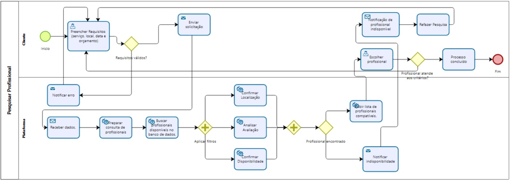

### 3.3.2 Processo 2 – Pesquisar profissional

Início
O cliente preenche os requisitos (tipo de serviço, local, data e orçamento). Em seguida, o sistema valida se todos os requisitos foram preenchidos corretamente. Se houver algum erro ou dado inválido, o sistema notifica o cliente, que deve ajustar as informações.
Se os requisitos estiverem corretos, a solicitação é enviada à plataforma, que recebe os dados do cliente e consulta o banco de dados de profissionais. A plataforma aplica filtros de localização, avaliação e disponibilidade para buscar por profissionais compatíveis.
Após isso, a plataforma verifica se encontrou profissionais que atendam aos critérios.
Se não, o cliente é notificado sobre a indisponibilidade desse profissional.
Se sim, apresenta ao cliente uma lista para que ele escolha o profissional ideal.
O cliente então, escolhe o profissional e verifica se ele realmente atende a todos os critérios.
Se sim, o processo é concluído com sucesso. Se não, o cliente é notificado sobre a indisponibilidade de profissionais e pode refazer a pesquisa.

Imagem : DAVI

#### Detalhamento das atividades

Imagem - TELA: CAMILLA

### Tela: Nossos Serviços

### Tela "Entre em Contato"

* **Área de texto** - Título "Entre em Contato"
* **Área de texto** - Subtítulo "Pronto para transformar sua casa?..."
* **Imagem** - Ícone "Solicitar Orçamento"
* **Área de texto** - Título do formulário "Solicitar Orçamento"
* **Caixa de texto** - Nome Completo ("Seu nome")
* **Caixa de texto** - Telefone ("(11) 9999-9999")
* **Caixa de texto** - Email ("seu@email.com")
* **Seleção única** - Serviço Desejado ("Selecione um serviço")
* **Caixa de texto** - Endereço ("Rua, número, bairro")
* **Área de texto** - Detalhes do Serviço ("Descreva o que você precisa...")
* **Link** - Botão "Enviar Solicitação"
* **Área de texto** - Nota de rodapé do formulário ("Entraremos em contato...")
* **Área de texto** - Título da seção "Informações de Contato"
* **Imagem** - Ícone "Telefone"
* **Área de texto** - Label "Telefone"
* **Área de texto** - Valor "(11) 9999-9999"
* **Área de texto** - Info "Seg a Sex, 8h às 18h"
* **Imagem** - Ícone "Email"
* **Área de texto** - Label "Email"
* **Área de texto** - Valor "contato@casaservicos.com"
* **Área de texto** - Info "Respondemos em até 2h"
* **Imagem** - Ícone "Área de Atendimento"
* **Área de texto** - Label "Área de Atendimento"
* **Área de texto** - Valor "São Paulo e Região"
* **Área de texto** - Info "Zona Sul, Oeste e Centro"
* **Imagem** - Ícone "Horário de Funcionamento"
* **Área de texto** - Label "Horário de Funcionamento"
* **Área de texto** - Valor "Segunda a Sábado"
* **Área de texto** - Info "8h às 18h"
* **Link** - "Perguntas Frequentes"
* **Link** - Botão flutuante "WhatsApp" (Ícone verde)
* **Link** - Botão flutuante "Chat" (Ícone escuro)

**1-Cabeçalho da Página (Informativo)**

| **Campo** | **Tipo** | **Restrições** | **Valor** |
| :--- | :--- | :--- | :--- |
| Título "Entre em Contato" | Área de texto | N/A | Valor default (fixo) |
| Subtítulo "Pronto para..." | Área de texto | N/A | Valor default (fixo) |

| **Comandos** | **Destino** | **Tipo** |
| :--- | :--- | :--- |
| (Nenhum) | N/A | N/A |

---

**2-Formulário "Solicitar Orçamento"**

| **Campo** | **Tipo** | **Restrições** | **Valor** |
| :--- | :--- | :--- | :--- |
| Nome Completo | Caixa de texto | Obrigatório | Valor default ("Seu nome") |
| Telefone | Caixa de texto | Obrigatório, (formato (XX) XXXX-XXXX) | Valor default ("(11) 9999-9999") |
| Email | Caixa de texto | Obrigatório, (formato email válido) | Valor default ("seu@email.com") |
| Serviço Desejado | Seleção única | Obrigatório | Valor default ("Selecione um serviço") |
| Endereço | Caixa de texto | Obrigatório | Valor default ("Rua, número, bairro") |
| Detalhes do Serviço | Área de texto | Obrigatório, (ex: min 20 caracteres) | Valor default ("Descreva o que...") |
| (Nota de Rodapé) | Área de texto | N/A | "Entraremos em contato..." |

| **Comandos** | **Destino** | **Tipo** |
| :--- | :--- | :--- |
| Enviar Solicitação | Gateway "Dados completos?" | default |

---

**3-Bloco "Informações de Contato"**

| **Campo** | **Tipo** | **Restrições** | **Valor** |
| :--- | :--- | :--- | :--- |
| (Info Telefone) | (Texto informativo) | N/A | (Valor fixo "(11) 9999-9999", "Seg a Sex...") |
| (Info Email) | (Texto informativo) | N/A | (Valor fixo "contato@casaservicos.com"...) |
| (Info Área de Atendimento) | (Texto informativo) | N/A | (Valor fixo "São Paulo e Região"...) |
| (Info Horário) | (Texto informativo) | N/A | (Valor fixo "Segunda a Sábado", "8h às 18h") |

| **Comandos** | **Destino** | **Tipo** |
| :--- | :--- | :--- |
| Perguntas Frequentes | Tela "FAQ" (ou âncora) | navigation |

