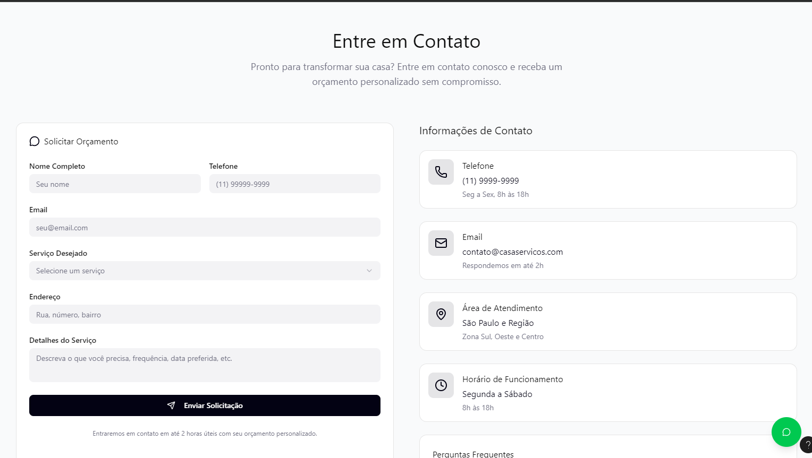

### 3.3.2 Processo 2 – Pesquisar profissional

Início
O cliente preenche os requisitos (tipo de serviço, local, data e orçamento). Em seguida, o sistema valida se todos os requisitos foram preenchidos corretamente. Se houver algum erro ou dado inválido, o sistema notifica o cliente, que deve ajustar as informações.
Se os requisitos estiverem corretos, a solicitação é enviada à plataforma, que recebe os dados do cliente e consulta o banco de dados de profissionais. A plataforma aplica filtros de localização, avaliação e disponibilidade para buscar por profissionais compatíveis.
Após isso, a plataforma verifica se encontrou profissionais que atendam aos critérios.
Se não, o cliente é notificado sobre a indisponibilidade desse profissional.
Se sim, apresenta ao cliente uma lista para que ele escolha o profissional ideal.
O cliente então, escolhe o profissional e verifica se ele realmente atende a todos os critérios.
Se sim, o processo é concluído com sucesso. Se não, o cliente é notificado sobre a indisponibilidade de profissionais e pode refazer a pesquisa.

#### Detalhamento das atividades

_Descreva aqui cada uma das propriedades das atividades do processo 2. 
Devem estar relacionadas com o modelo de processo apresentado anteriormente._

### Tela: Nossos Serviços

### Tela "Entre em Contato"
* **Área de texto** - Título "Entre em Contato"
* **Área de texto** - Subtítulo "Pronto para transformar sua casa?..."
* **Imagem** - Ícone "Solicitar Orçamento"
* **Área de texto** - Título do formulário "Solicitar Orçamento"
* **Caixa de texto** - Nome Completo ("Seu nome")
* **Caixa de texto** - Telefone ("(11) 9999-9999")
* **Caixa de texto** - Email ("seu@email.com")
* **Seleção única** - Serviço Desejado ("Selecione um serviço")
* **Caixa de texto** - Endereço ("Rua, número, bairro")
* **Área de texto** - Detalhes do Serviço ("Descreva o que você precisa...")
* **Link** - Botão "Enviar Solicitação"
* **Área de texto** - Nota de rodapé do formulário ("Entraremos em contato...")
* **Área de texto** - Título da seção "Informações de Contato"
* **Imagem** - Ícone "Telefone"
* **Área de texto** - Label "Telefone"
* **Área de texto** - Valor "(11) 9999-9999"
* **Área de texto** - Info "Seg a Sex, 8h às 18h"
* **Imagem** - Ícone "Email"
* **Área de texto** - Label "Email"
* **Área de texto** - Valor "contato@casaservicos.com"
* **Área de texto** - Info "Respondemos em até 2h"
* **Imagem** - Ícone "Área de Atendimento"
* **Área de texto** - Label "Área de Atendimento"
* **Área de texto** - Valor "São Paulo e Região"
* **Área de texto** - Info "Zona Sul, Oeste e Centro"
* **Imagem** - Ícone "Horário de Funcionamento"
* **Área de texto** - Label "Horário de Funcionamento"
* **Área de texto** - Valor "Segunda a Sábado"
* **Área de texto** - Info "8h às 18h"
* **Link** - "Perguntas Frequentes"
* **Link** - Botão flutuante "WhatsApp" (Ícone verde)
* **Link** - Botão flutuante "Chat" (Ícone escuro)

**1-Preencher Requisitos**

| **Campo**       | **Tipo**         | **Restrições** | **Valor** |
| ---             | ---              | ---            | ---               |
| Serviço | Caixa de texto (ou Seleção)  |   Obrigatório    |   Valor default       |
| Local (Endereço/CEP) | Caixa de texto  |   Obrigatório    |   Valor default       |
| Data (do serviço) | Data (ou Seleção)  |   Obrigatório, data futura    |   Valor default       |
| Orçamento (Valor Máx.) | Número  |   Opcional    |   Valor default       |

| **Comandos**         |  **Destino**                   | **Tipo** |
| ---                  | ---                            | ---               |
| Buscar Profissionais | Evento de Início  | default  |     
| Cancelar | Gateway "Requisitos válidos?"  | cancel |                |

**2-Enviar solicitação**

| **Campo**       | **Tipo**         | **Restrições** | **Valor** |
| ---             | ---              | ---            | ---               |
| Observações Adicionais | Área de texto  |     Opcional           |    Valor default               |

| **Comandos**         |  **Destino**                   | **Tipo**          |
| ---                  | ---                            | ---               |
| Confirmar Solicitação | Atividade "Receber dados" (Plataforma)  | default |
| Editar (Voltar) | Atividade "Preencher Requisitos"  | cancel |

**3-Escolher profissional**

| **Campo**       | **Tipo**         | **Restrições** | **Valor** |
| ---             | ---              | ---            | ---               |
| Lista de Profissionais | Seleção única (Radio button ou Tabela)  |     Obrigatório          |    Valor default               |

| **Comandos**         |  **Destino**                   | **Tipo**          |
| ---                  | ---                            | ---               |
| Selecionar | Gateway "Profissional atende aos critérios?"  | default |
| Voltar | Atividade "Preencher Requisitos"  | cancel |

**4-Notificação de profissional indisponível**

| **Campo**       | **Tipo**         | **Restrições** | **Valor** |
| ---             | ---              | ---            | ---               |
| Ícone de Alerta | Imagem  |  N/A    |    Valor default               |
| Texto da Notificação | Apenas texto informativo  |  N/A    |    Valor default               |

| **Comandos**         |  **Destino**                   | **Tipo**          |
| ---                  | ---                            | ---               |
| OK  | Atividade "Refazer Pesquisa" | default |

**5-Refazer Pesquisa**

| **Campo**       | **Tipo**         | **Restrições** | **Valor** |
| ---             | ---              | ---            | ---               |
| (Apenas texto informativo) | N/A  |  N/A    |    Valor default               |

| **Comandos**         |  **Destino**                   | **Tipo**          |
| ---                  | ---                            | ---               |
| Refazer Pesquisa | Atividade "Preencher Requisitos" | default |
| Sair | Evento de Fim | cancel |

