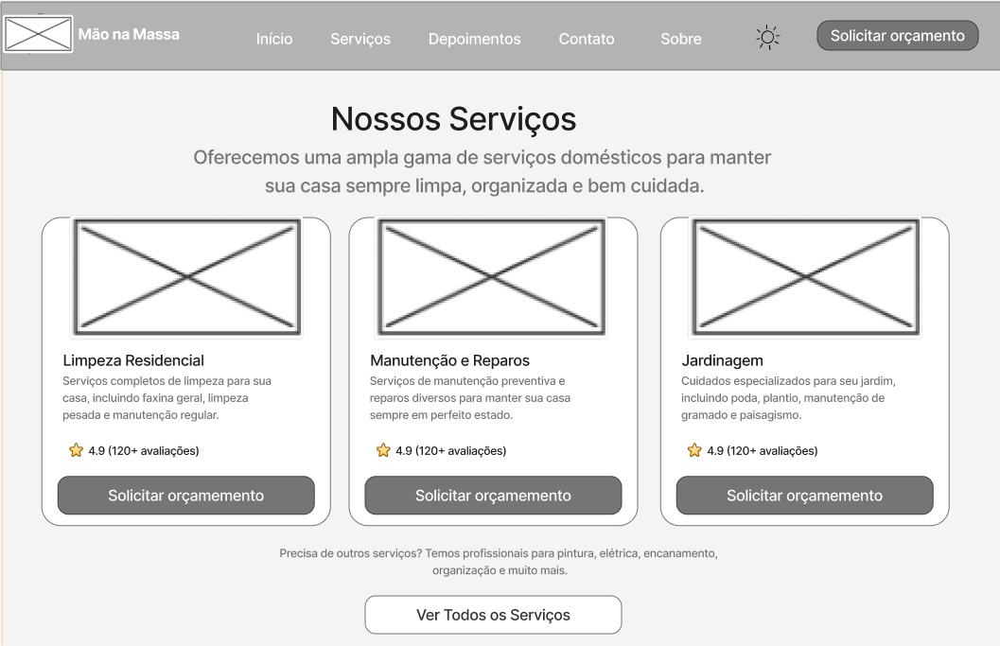

### 3.3.3 Processo 3 – Solicitar serviço

O processo de solicitação de serviço inicia-se com o cliente acessando a plataforma, onde pode visualizar o perfil do profissional e inserir detalhes do serviço. Após o preenchimento das informações, a plataforma verifica se os dados estão completos para realizar o envio da solicitação. Caso haja algum dado incompleto ou falha, a plataforma notifica o cliente sobre o erro e o processo é interrompido até que os dados sejam corrigidos.
Com os dados completos, a plataforma encaminha a solicitação ao profissional, que analisa o tipo de serviço solicitado e decide se deseja aceitar ou não. Caso o profissional recuse a solicitação, o cliente é notificado e pode optar por procurar outro profissional ou refazer a pesquisa.
Caso o profissional aceite o serviço, a plataforma confirma a solicitação, cria um canal de comunicação entre as partes e notifica  o cliente. A confirmação da aceitação encerra o processo de solicitação de serviço, concluindo a etapa na plataforma.

Imagem : DAVI

#### Detalhamento das atividades

_Os tipos de dados a serem utilizados são:_

* **Área de texto** - Descrição da Página ("Oferecemos uma ampla gama...")
* **Área de texto** - Descrição do Serviço (Limpeza Residencial)
* **Área de texto** - Descrição do Serviço (Manutenção e Reparos)
* **Área de texto** - Descrição do Serviço (Jardinagem)
* **Área de texto** - Texto (Outros serviços - "Precisa de outros serviços?...")
* **Imagem** - Logo (Mão na Massa)
* **Imagem** - Imagem do Serviço (Limpeza Residencial)
* **Imagem** - Imagem do Serviço (Manutenção e Reparos)
* **Imagem** - Imagem do Serviço (Jardinagem)
* **Link** - Início
* **Link** - Serviços
* **Link** - Depoimentos
* **Link** - Contato
* **Link** - Sobre
* **Link** - Solicitar orçamento (no topo)
* **Link** - Solicitar orçamento (card Limpeza Residencial)
* **Link** - Solicitar orçamento (card Manutenção e Reparos)
* **Link** - Solicitar orçamento (card Jardinagem)
* **Link** - Ver Todos os Serviços

**1-Inserir Detalhes do Serviço**

| **Campo**       | **Tipo**         | **Restrições** | **Valor** |
| ---             | ---              | ---            | ---               |
| Data do Serviço | Data  |  Obrigatório, data futura   |   Valor default       |
| Horário (preferencial) | Hora  |   Obrigatório    |   Valor default       |
| Endereço do Serviço | Caixa de Texto  |   Obrigatório   |   Valor default       |
| Descrição do Serviço | Área de texto  |  Obrigatório, (ex: min 20 caracteres)  |   Valor default       |
| (Perfil do Profissional) |  (Informativo) |  Obrigatório, data futura   |   (Dados do profissional são exibidos)       |

| **Comandos**         |  **Destino**                   | **Tipo** |
| ---                  | ---                            | ---               |
| Enviar Solicitação | Gateway "Dados completos?"  | default  |     
| Voltar (ou Cancelar) | Evento de Início | cancel |                |

**2-Analisar Solicitação de Serviço**

| **Campo**       | **Tipo**         | **Restrições** | **Valor** |
| ---             | ---              | ---            | ---               |
| (Dados da Solicitação) | (Texto informativo)  |  N/A   |   Valor default       |

| **Comandos**         |  **Destino**                   | **Tipo** |
| ---                  | ---                            | ---               |
| Aceitar | Evento "Confirmar Solicitação"  | default  |     
| Recusar (ou Cancelar) | Evento "Recusar solicitação" | cancel |                |

**3-Solicitação Concluída**

| **Campo**       | **Tipo**         | **Restrições** | **Valor** |
| ---             | ---              | ---            | ---               |
| (Mensagem de Sucesso) | (Texto informativo)  |  N/A   |   Valor default       |
| (Ícone de Sucesso) | Imagem  |  N/A   |   Valor default       |

| **Comandos**         |  **Destino**                   | **Tipo** |
| ---                  | ---                            | ---               |
| OK | Evento de Fim  | default  |     
| Abrir Chat | Atividade "Criar canal de comunicação" | cancel |                |

**4-Solicitação Concluída**

| **Campo**       | **Tipo**         | **Restrições** | **Valor** |
| ---             | ---              | ---            | ---               |
| (Mensagem de Erro) | (Texto informativo)  |  N/A   |   Valor default       |

| **Comandos**         |  **Destino**                   | **Tipo** |
| ---                  | ---                            | ---               |
| Tentar Novamente | Atividade "Inserir detalhes do serviço"  | default  |   
| Buscar Outro Profissional | Atividade "Retomar processo de pesquisa"  | default  |  
| Cancelar | Evento de Fim | cancel |                |