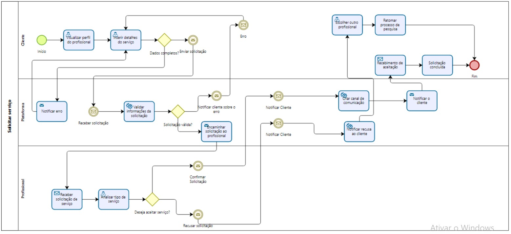
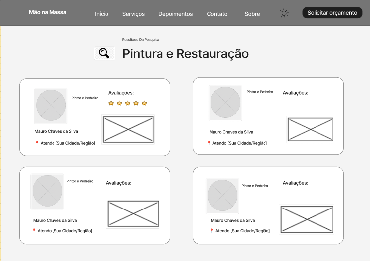

### 3.3.3 Processo 3 – Solicitar serviço

O Processo 3 – Solicitar Serviço inicia-se imediatamente após a seleção de um profissional no Processo 2. Ele foca na confirmação e envio formal da solicitação para o profissional escolhido, sem a necessidade de preencher novos detalhes (pois esses foram informados na Etapa 1 do Processo 2).

O fluxo é dividido em duas etapas principais:

Etapa 1 – Confirmar Solicitação: O cliente revisa os detalhes do profissional selecionado e confirma que deseja enviar a solicitação para ele. O sistema exibe um resumo do profissional (foto, nome, serviço, avaliação).

Etapa 2 – Solicitação Enviada: Após confirmação, o sistema registra a solicitação e exibe uma mensagem de sucesso, informando que o profissional será notificado e entrará em contato.

Entrada deste processo: Profissional selecionado + dados da solicitação (do Processo 2).
Saída: Solicitação enviada e registrada no sistema; cliente aguarda resposta do profissional.
Observação: No código, este processo é a continuação direta do anterior, sem telas separadas – é uma jornada única.

#### Detalhamento das atividades

_Os tipos de dados a serem utilizados são:_

* **Área de texto** - Descrição da Página ("Oferecemos uma ampla gama...")
* **Área de texto** - Descrição do Serviço (Limpeza Residencial)
* **Área de texto** - Descrição do Serviço (Manutenção e Reparos)
* **Área de texto** - Descrição do Serviço (Jardinagem)
* **Área de texto** - Texto (Outros serviços - "Precisa de outros serviços?...")
* **Imagem** - Logo (Mão na Massa)
* **Imagem** - Imagem do Serviço (Limpeza Residencial)
* **Imagem** - Imagem do Serviço (Manutenção e Reparos)
* **Imagem** - Imagem do Serviço (Jardinagem)
* **Link** - Início
* **Link** - Serviços
* **Link** - Depoimentos
* **Link** - Contato
* **Link** - Sobre
* **Link** - Solicitar orçamento (no topo)
* **Link** - Solicitar orçamento (card Limpeza Residencial)
* **Link** - Solicitar orçamento (card Manutenção e Reparos)
* **Link** - Solicitar orçamento (card Jardinagem)
* **Link** - Ver Todos os Serviços

**1-"Confirmar Solicitação" (ID etapa3)**

| **Campo**       | **Tipo**         | **Restrições** | **Valor** |
| ---             | ---              | ---            | ---               |
| Instrução| Texto informativo  | N/A  |  Você está prestes a enviar sua solicitação para:"     |
| Detalhes do Profissional (#detalhes-profissional)| Container dinâmico (HTML gerado via JS)  |  N/A; preenchido pela função selecionarProfissional()  |  Foto, nome, serviço, rating do profissional selecionado     |
| Nota informativa | Texto informativo|   N/A   |  "O profissional será notificado e entrará em contato para confirmar o agendamento e o valor final." |

### Comandos

| **Comandos** | **Destino** | **Tipo** |
| :--- | :--- | :--- |
| Escolher Outro (`#btnVoltarLista`) | Retorna à Etapa 2 do Processo 2 (lista de profissionais) | default |
| Confirmar e Enviar (`#btnConfirmar`) | Gateway "Confirmação válida?" → Etapa 2 deste processo | default |

---

####  Gateway "Confirmação válida?"
*(Implementado no evento click do botão `#btnConfirmar`)*

**1. Condições de validação:**
* `profissionalSelecionado` não é null (garantido pela seleção na etapa anterior).
* Dados da solicitação (do Processo 2) ainda estão disponíveis.

**2. Fluxo (Se NÃO válidos):**
* *(Cenário improvável, pois o fluxo vem controlado do Processo 2).*
* O código atual não trata explicitamente, mas em produção haveria verificação/alert de erro.

**3. Fluxo (Se Válidos):**
* Preenche `#profissional-confirmado` com o nome do profissional.
* **Ação:** Avança para a **Etapa 2**, exibindo mensagem de sucesso.

> **Exemplo prático de uso:**
> Após selecionar "José Carlos" no Processo 2, cliente vê: foto dele, "José Carlos", "Serviço: Elétrica", "⭐⭐⭐⭐⭐ (4.9)".
> Clica "Confirmar e Enviar" → Vai para Etapa 2 com a mensagem "Seu pedido foi enviado para José Carlos."

**2-Solicitação Enviada (Sucesso)**

Tela/Atividade: Etapa 4 – "Solicitação Enviada!" (ID etapa4)
Esta é a conclusão do processo, confirmando que a solicitação foi processada.

| **Campo**       | **Tipo**         | **Restrições** | **Valor** |
| ---             | ---              | ---            | ---               |
|Ícone de Sucesso| Emoji/Imagem | N/A  |  "✅" (grande, centralizado)   |
| Título(#detalhes-profissional)| Texto informativo|  N/A|"Solicitação Enviada!"|
| Nota adicional | Texto informativo|   N/A   |  "Aguarde o contato do profissional para finalizar o agendamento."|

### Conclusão do Pedido (Mensagem de Sucesso)

| **Comandos** | **Destino** | **Tipo** |
| :--- | :--- | :--- |
| Fazer Nova Solicitação (`#btnNovo`) | Retorna à Etapa 1 do Processo 2 (limpa formulário e reseta mapa) | default |
| Recusar (ou Cancelar) | Evento "Recusar solicitação" | cancel |

---

#### Lógica de Conclusão
*(Processamento final e preparação para novo ciclo)*

**1. Exibição da Confirmação:**
* *(Executado ao entrar nesta tela, vindo do botão `#btnConfirmar`)*
* Preenche a mensagem de sucesso com o nome do profissional selecionado.

**2. Reset de Variáveis (Ao clicar em Nova Solicitação):**
* Limpa a variável `profissionalSelecionado` (define como `null`).
* Limpa os campos do formulário da busca anterior.
* Se o mapa foi alterado, reseta para a localização padrão (ex: Belo Horizonte).

> **Exemplo prático de uso:**
> **Visualização:** O usuário vê a mensagem: "Seu pedido foi enviado para José Carlos. Aguarde o contato do profissional para finalizar o agendamento."
> **Ação:** Cliente clica em "Fazer Nova Solicitação" → O sistema volta para a tela inicial de busca, com todos os campos limpos e o mapa resetado.